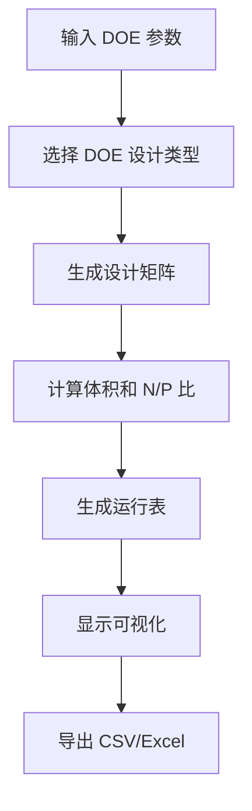

# DOE Designer 与 pDNA 方法整合 - 快速参考

## 📌 更新概览

DOE Designer (6_🀄️_High-Throughput_Formulation.py) 现已集成 pDNA Formulation 的计算方法，特别是：

✅ **N/P 比计算** - 采用 pDNA 的 `calculate_np_ratio()` 函数  
✅ **运行表增强** - 添加 N/P 比列用于实验记录  
✅ **体积计算改进** - 返回离子化脂质摩尔数用于 N/P 验证  
✅ **UI 统计** - 显示 N/P 比范围统计  
✅ **导出数据** - Excel 包含完整 N/P 信息  

---

## 🔧 核心改进

### 函数变更

#### 1. 新增：`calculate_np_ratio()`

```python
np_ratio, amine_moles, phosphate_moles = calculate_np_ratio(
    dna_mass_ug=3.0,  # DNA 质量（微克）
    ionizable_lipid_moles=10.0,  # 离子化脂质（微摩尔）
    amines_per_molecule=1.0  # 每个分子的胺基数
)
# 返回: (N/P比, N摩尔数, P摩尔数)
```

**公式**:
- $P = \frac{DNA\_mass\_\mu g}{330} \times 10^6$ (微摩尔)
- $N = ionizable\_lipid\_moles \times amines\_per\_molecule$ (微摩尔)
- $\frac{N}{P} = \frac{N}{P}$

#### 2. 改进：`calculate_volumes()`

返回字典现包含:
```python
{
    "Ionizable_Vol_uL": float,      # 吸液体积
    "Helper_Vol_uL": float,
    "Chol_Vol_uL": float,
    "PEG_Vol_uL": float,
    "Ethanol_Vol_uL": float,
    "Buffer_Vol_uL": float,
    "Total_Vol_uL": float,
    "Ionizable_Moles": float        # ← 新增（用于 N/P 计算）
}
```

#### 3. 升级：`generate_run_sheet()`

新参数（可选）：
```python
def generate_run_sheet(
    design_df, num_replicates, num_blocks,
    mw_ion, mw_helper, mw_chol, mw_peg,
    conc_ion, conc_helper, conc_chol, conc_peg,
    target_vol_ul,
    dna_mass_ug=None,        # ← 新参数
    dna_concentration=None   # ← 新参数
):
```

新增列：
- `NP_Ratio_Target` - DOE 设计中的目标 N/P 比
- `NP_Ratio_Calc` - 计算的 N/P 比（需要 DNA 质量参数）

---

## 📊 运行表结构

| 列 | 类型 | 示例 | 说明 |
|----|------|------|------|
| Block | int | 1 | 实验块 |
| Run_ID | str | R001 | 运行编号 |
| Experiment | int | 1 | 设计点 |
| Replicate | int | 1 | 重复序号 |
| Ionizable_% | float | 50.0 | 摩尔比例 |
| Helper_% | float | 35.0 | 计算值 |
| Cholesterol_% | float | 10.0 | 摩尔比例 |
| PEG_% | float | 5.0 | 摩尔比例 |
| NP_Ratio_Target | float/str | 5.0 | DOE 变量 |
| NP_Ratio_Calc | float/str | N/A | 需要 DNA 参数 |
| Ionizable_Vol_uL | float | 125.43 | 吸液体积 |
| Helper_Vol_uL | float | 89.56 | 吸液体积 |
| Chol_Vol_uL | float | 23.14 | 吸液体积 |
| PEG_Vol_uL | float | 5.67 | 吸液体积 |
| Ethanol_Vol_uL | float | 50.0 | 有机相 |
| Buffer_Vol_uL | float | 100.0 | 水相 |
| Total_Vol_uL | float | 200.0 | 总体积 |
| Timestamp | str | 2024-01-15... | 生成时间 |
| Notes | str | "" | 用户备注 |

---

## 🚀 使用流程

### 基本步骤



### 当前使用

1. **配置**：系统自动加载组件数据
2. **设计**：选择 DOE 类型、参数范围、重复次数
3. **生成**：点击"🚀 Generate DOE Design"按钮
4. **查看**：检查设计矩阵和运行表
5. **导出**：下载 CSV 或 Excel 文件

### 显示的统计信息

生成设计后，系统显示：
- ✅ 设计类型
- ✅ 设计点数
- ✅ 总运行次数
- ✅ 重复次数
- ✅ 响应类型

以及详细的参数覆盖范围：
- 摩尔比例范围
- 体积范围
- **N/P 比范围**（新增）

---

## 🎯 后续改进路线

### 第一阶段：基础集成（已完成）
- [x] N/P 比计算函数
- [x] 运行表 N/P 列
- [x] UI 显示 N/P 统计

### 第二阶段：用户输入（待实施）
- [ ] DNA 质量输入字段
- [ ] DNA 浓度输入字段
- [ ] 自动 N/P 比计算显示

### 第三阶段：高级功能（未来考虑）
- [ ] Aqueous-to-Ethanol 比作为变量
- [ ] DNA 体积、柠檬酸盐体积计算
- [ ] 批量制备缩放（1.5x 乙醇、1.2x 水）
- [ ] 历史记录集成（如 pDNA 页面）
- [ ] N/P 比范围验证警告

---

## 🔗 文件位置

| 文件 | 位置 | 说明 |
|------|------|------|
| DOE Designer | pages/6_🀄️_High-Throughput_Formulation.py | 主程序 |
| 详细文档 | DOE_PDNA_INTEGRATION.md | 技术详情 |
| 集成摘要 | INTEGRATION_SUMMARY.md | 概览 |
| 测试脚本 | test_doe_pdna_integration.py | 验证脚本 |

---

## 💾 数据导出

### CSV 格式
- 单个工作表
- 所有列包含 N/P 比信息
- 易于后处理

### Excel 格式
三个工作表：
1. **Run Sheet** - 完整运行表
2. **Design Matrix** - 设计点和摩尔比例
3. **Summary** - 元数据和统计信息

---

## 🔍 验证检查清单

使用 DOE Designer 时检查：

- [ ] 组件数据库已加载（显示在顶部）
- [ ] DOE 参数范围有效（Min < Max）
- [ ] 设计类型已选择
- [ ] 运行表包含所有必需列
- [ ] N/P 比列存在（显示 N/A 是正常的，直到 DNA 参数提供）
- [ ] 体积计算合理（总体积 ≈ 200 μL）
- [ ] 导出文件包含完整数据

---

## 💡 常见问题

### Q: 为什么 NP_Ratio_Calc 显示 "N/A"？
**A**: DNA 质量参数未在 UI 中提供。这将在第二阶段添加。

### Q: N/P 比如何计算？
**A**: 使用公式 `N/P = (Ionizable_Moles × 1) / (DNA_mass / 330 × 1e6)`

### Q: 体积单位是什么？
**A**: 所有体积以微升 (μL) 表示

### Q: 如何调整脂质浓度？
**A**: 在"Component Database Configuration"中修改浓度值

### Q: 可以更改目标体积吗？
**A**: 当前固定为 200 μL。后续版本可改进。

---

## 📞 支持信息

- 整合日期: 2024 年
- 基于: pDNA Formulation 页面 (pages/2_🧬_pDNA_formulation.py)
- 状态: ✅ 活跃开发
- 单位系统: 微摩尔 (μmol)、微升 (μL)、mg/mL

